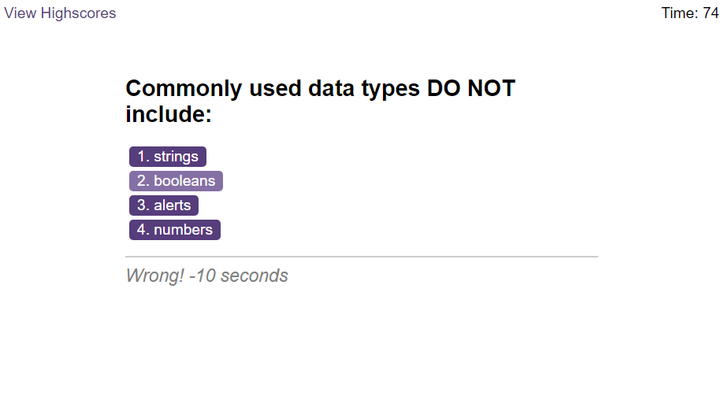
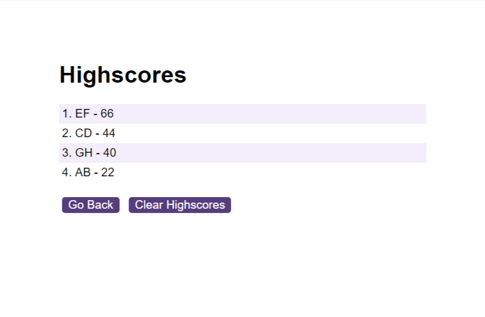

# Coding Quiz Challenge

## Description
This project is a web-based coding quiz application that tests users on JavaScript fundamentals. Users can take a timed quiz, answer multiple-choice questions, and view their final score. Additionally, high scores are stored locally for users to gauge their progress compared to their peers.

## Demo

## Features

- Timed coding quiz with multiple-choice questions
- Dynamically updated HTML and CSS powered by JavaScript
- High scores stored locally for user comparison
- Clean, polished, and responsive user interface

## Usage

- Click the "Start Quiz" button to begin the coding quiz.
- Answer each multiple-choice question within the time limit.
- Receive immediate feedback on your answers.
- View your final score and save your initials to compare high scores.

## Contributing

Contributions are welcome! 

## Screenshot

*The above image illustrates an example question from the quiz along with feedback.*

*The above image showcases an example of the highscores list.*

## Deployment

This project is deployed and accessible at the following URLs:

- [Live Application](https://deponte-designer.github.io/Coding-Quiz): Visit this link to experience the Coding Quiz.
- [GitHub Repository](https://github.com/deponte-designer/Coding-Quiz): Visit the repository for project details, including a comprehensive README.

> Dive into the code and explore the results of this Coding Quiz.

## License

Copyright (c) 2023 [dePonte](https://github.com/deponte-designer)

Permission is hereby granted, free of charge, to any person obtaining a copy of this software and associated documentation files (the "Software"), to deal in the Software without restriction, including without limitation the rights to use, copy, modify, merge, publish, distribute, sublicense, and/or sell copies of the Software, and to permit persons to whom the Software is furnished to do so, subject to the following conditions:

The above copyright notice and this permission notice shall be included in all copies or substantial portions of the Software.

THE SOFTWARE IS PROVIDED "AS IS", WITHOUT WARRANTY OF ANY KIND, EXPRESS OR IMPLIED, INCLUDING BUT NOT LIMITED TO THE WARRANTIES OF MERCHANTABILITY, FITNESS FOR A PARTICULAR PURPOSE AND NONINFRINGEMENT. IN NO EVENT SHALL THE AUTHORS OR COPYRIGHT HOLDERS BE LIABLE FOR ANY CLAIM, DAMAGES OR OTHER LIABILITY, WHETHER IN AN ACTION OF CONTRACT, TORT OR OTHERWISE, ARISING FROM, OUT OF OR IN CONNECTION WITH THE SOFTWARE OR THE USE OR OTHER DEALINGS IN THE SOFTWARE.

## Badges

